### Merge

1. git 分支的工作模式

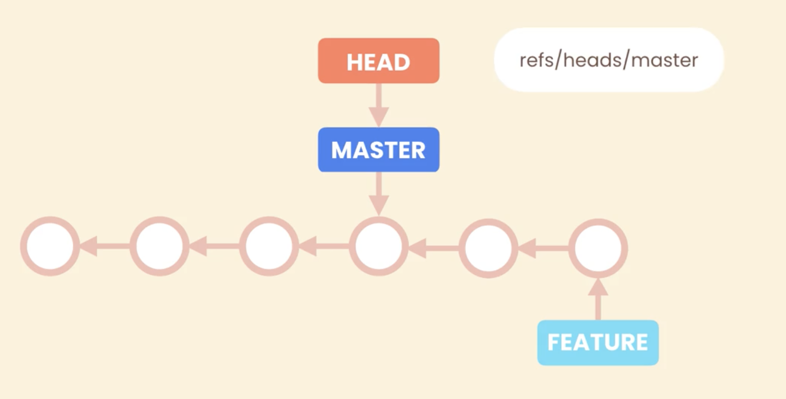

2. 合并分支的方式

- merge 命令
  1）fast-forward merge
  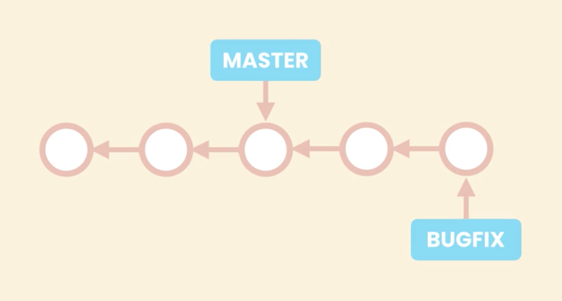
  <!-- 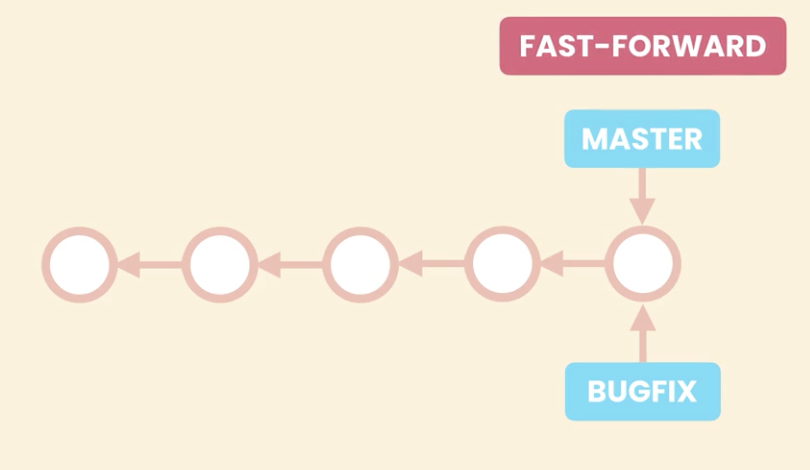 -->

  2）three-way merge
  
  <!-- 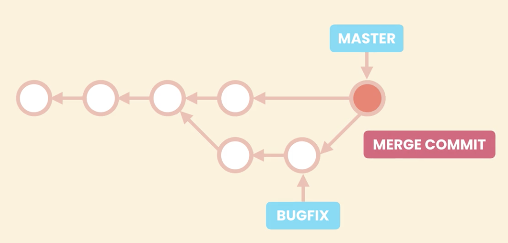 -->

- rebasing 命令(重写了历史)

  1. 效果
     <!-- 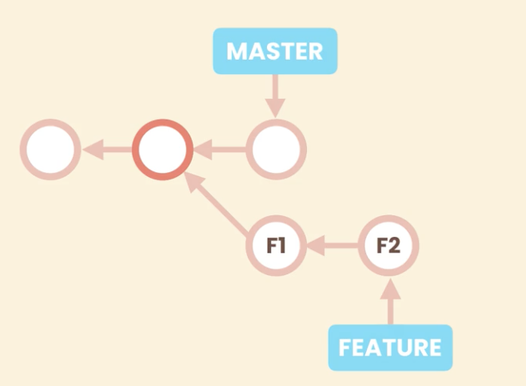 -->
     <!-- 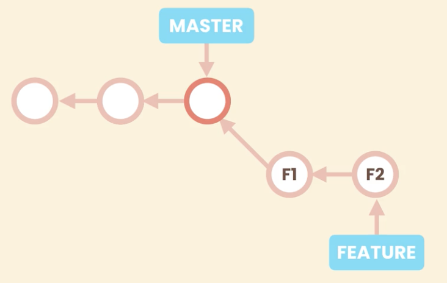 -->
     <!-- 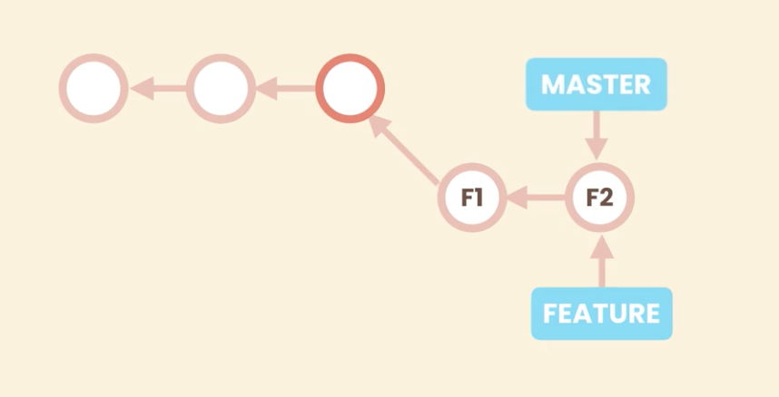 -->

  2. 原理
     <!-- 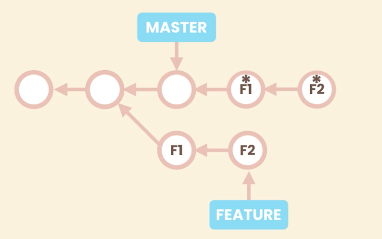 -->
     <!--  -->

### 后悔药

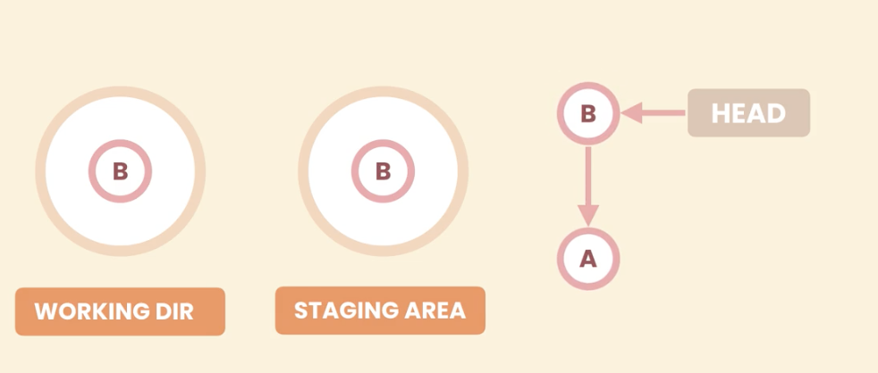

仓库：
git reset --hard HEAD~1

<!-- git restore --source=HEAD~1 . -->

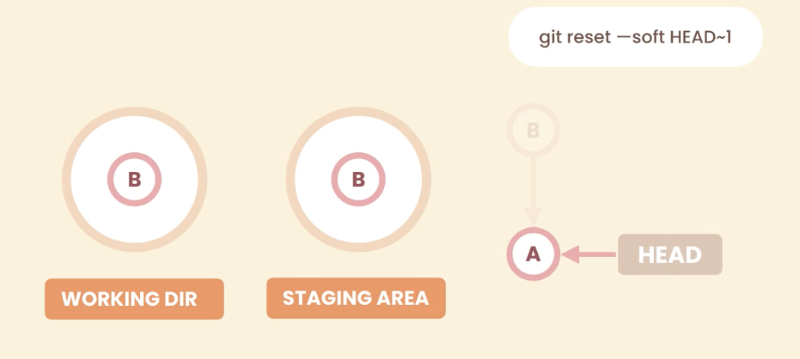

暂存区：
git reset --mixed HEAD~1

<!-- git restore --staged . -->

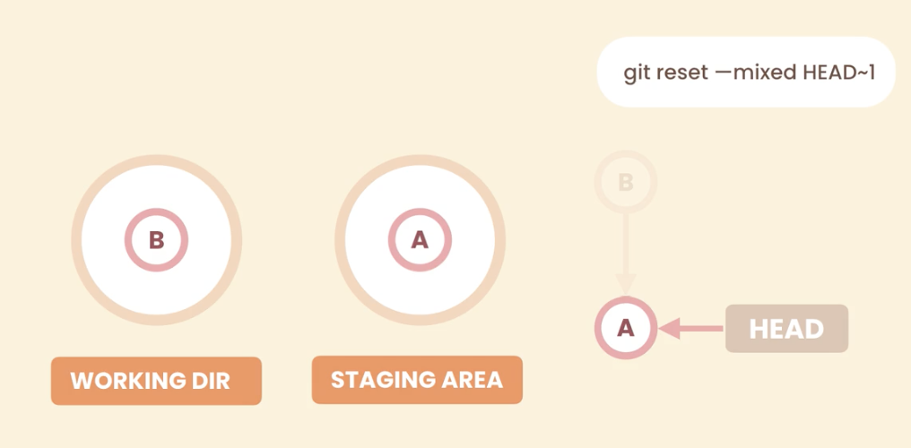

工作区：
git reset --hard HEAD~1
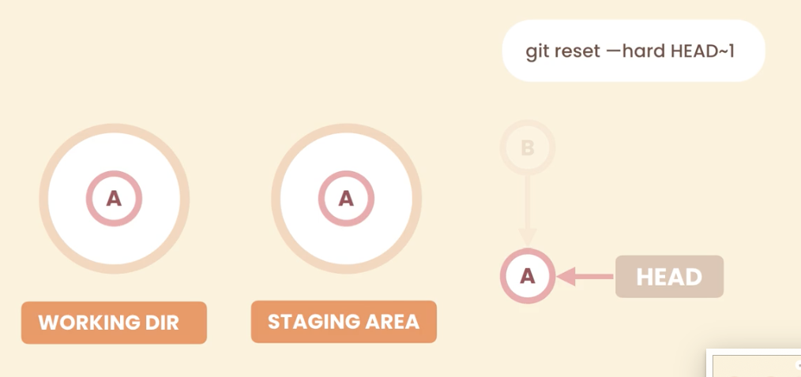

<!-- git restore . -->

如果我们已经 push 了之后，如何做撤销呢？

<!-- git revert HEAD~1 -->

<!-- 增加一个commit但是内容是之前的 -->
<!-- git revert HEAD~3..HEAD (不会包含第四个) -->
<!-- git revert --no-comit HEAD~3..HEAD (直接到暂存区，需commit) -->

如果是 three-way merge 的 commit，如何撤销呢？

<!-- 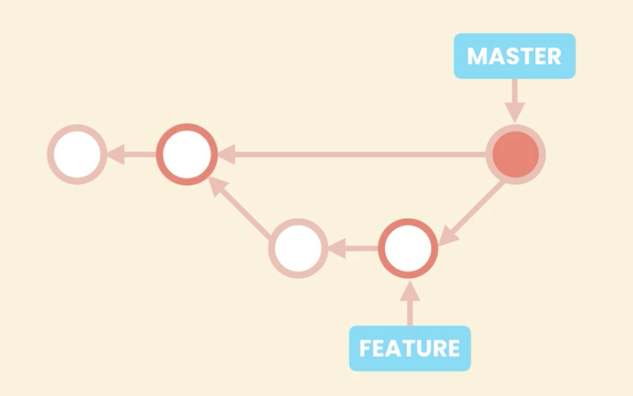 -->
<!-- git revert HEAD (会提示未指定父亲) -->

<!-- git revert -m 1 HEAD -->

### 时光机

git checkout `hash`

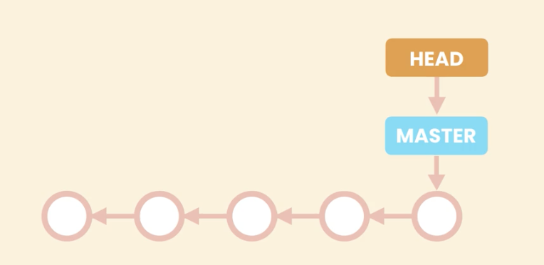

<!-- 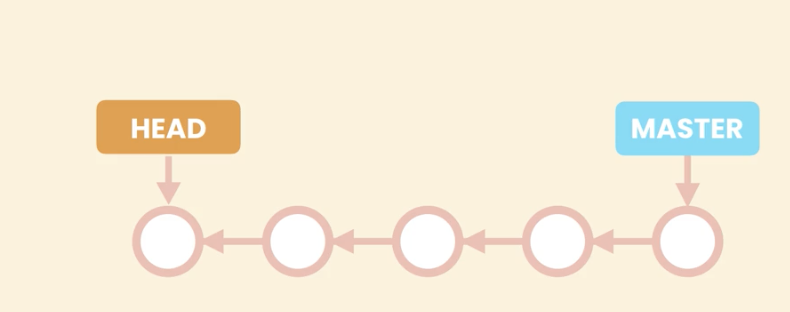 -->
<!-- 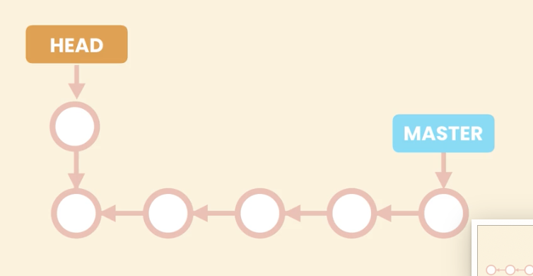 -->
<!-- 此处不要再commit了 -->

### 细节

1. pull = fetch + merge(three-way or rebasing)
2. git remote -v
   git remote add `name` `url`
   <!-- git remote rename `upstream` `base` -->
   <!-- git remote rm `name` -->
3. - bisect debug
   - squash merging
     git merge --squash `branchname`
     git commit -m `msg`
     <!-- 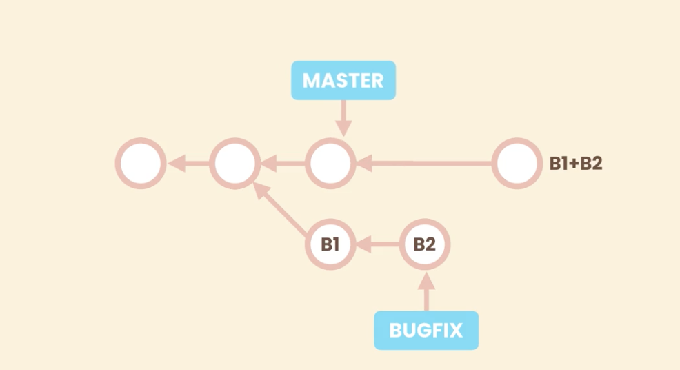 -->
     <!-- 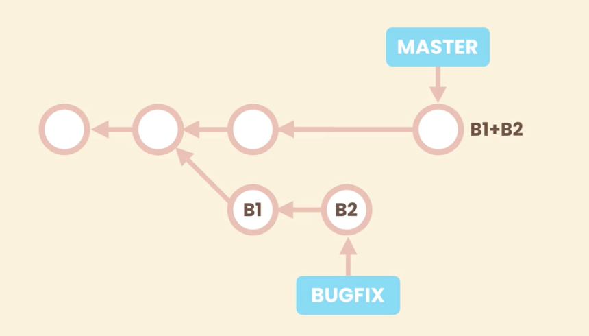 -->
   - cherry picking
     git cherry-pick `commitId`
     解决冲突
     然后 commit
     <!-- 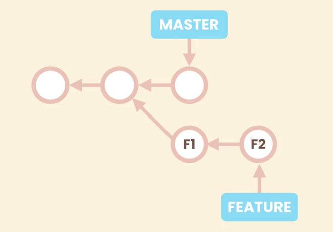 -->
     <!-- 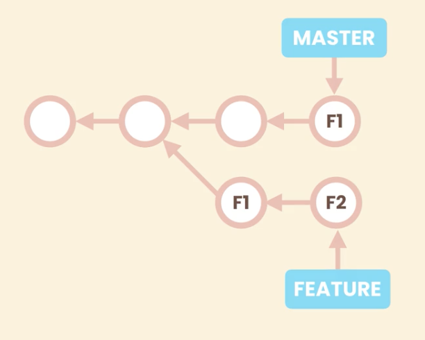 -->
   - 摘取分支中的某个文件
     1. switch to master <!--git switch to master -->
     2. git restore --source=`branchname` -- `filename`
     <!-- 把最新的branch的commit内容复制到master的工作区-->
     3. -am commit
4. 重写历史：

   - 恢复丢失的 commit（不小心 reset 到以前的某个 commit 上，如何恢复呢
     ？）

     1. git reset --hard HEAD~6 <!--不小心回到~6-->
     2. git reflog <!--查看路径、记录hash,只要head变化就会记录-->
     3. git reset --hard `hash` <!--回到-->

   - 修改最后一个 commit（提交后，发现有的文件忘改了，如何操作？）

     <!-- 1. 做修改
     2. git add .
     3. git commit -amend -m `msg` -->

     如果是有个文件忘记删除了呢？

     <!-- 1. git reset --mixed HEAD~1
     2. git add .
     3. git commit -m `msg` -->

   - 修改一个早的 commit

    <!-- 1. 原理是利用rebase，把要修改的及之前的commit全部替换；
    2. git rebase -i `target hash`
    3. 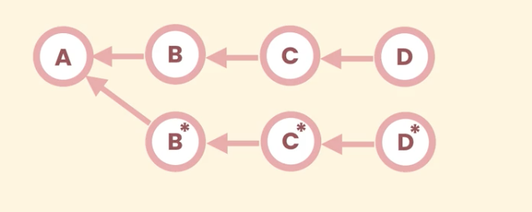
    4. do some changes -> git add . -> git commit -amend `msg`
    5. git rebase --continue or --abort -->
    <!-- 6. 修改的那个改变会一直保持到后面 -->

   - drop commit

     1. git rebase -i `hash`~1
     2. solve the conflict
     3. git rebase --continue

   - reword commit message（修改 message）

     1. git rebase -i `hash`

   -

git status -s 查看工作区改变后，暂存区的状态
git diff 工作区做的改变
git diff --staged 查看暂存区的改变
git diff --cached 查看仓库的变化
git show `hash`
git show HEAD~1:`文件名`
